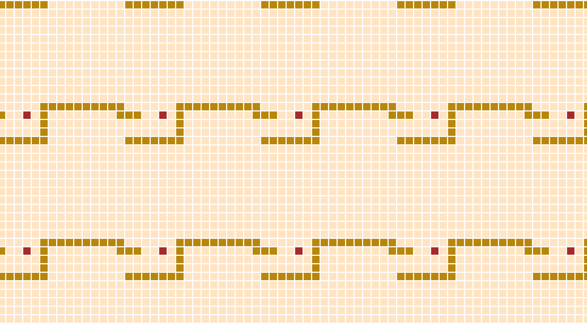

# Snake i JavaScript

Eftersom jag aldrig gjort något speciellt avancerat i JS tänkte jag göra klassiska SNAKE i helt vanlig JavaScript.

testa det [här](http://grgta.xyz/stuff/snake), och läs källkoden på [min github](https://github.com/gherghett/snake_js)

All "grafik" är bara HTML/CSS, rutnätet består helt av `
` element som bytar färg nät JavaScripten lägger till eller tar bort CSS-klasser.

