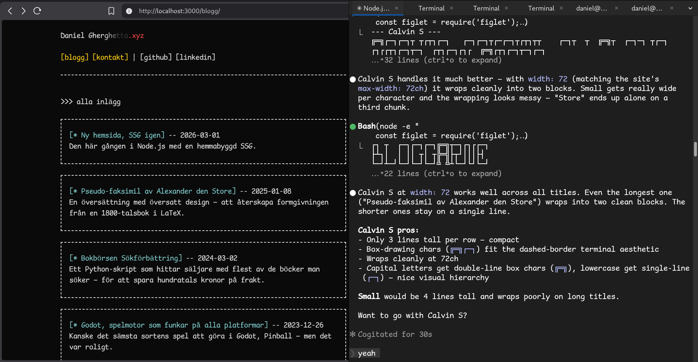
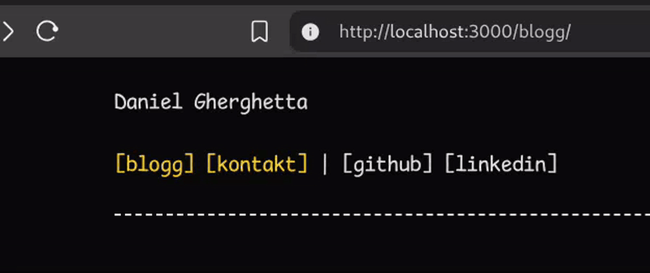
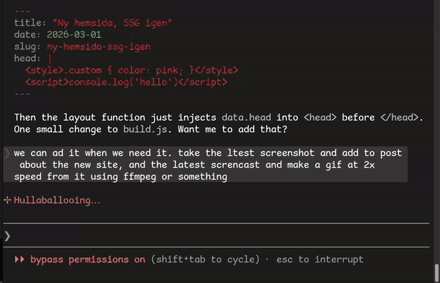

# Ny hemsida, SSG igen

Den här gången byggde jag om hemsidan med en egen SSG i Node.js som jag blivigt bekväm i på sistonde. Precis som förra gången är det ingen JS med i resultatet, bara HTML/CSS.

## Gör en cool animation så kommer resten sen

Jag satt en del med animationen i headern efter att jag bestämt mig för ett fixed-width tema med [Comic Mono](https://dtinth.github.io/comic-mono-font/) som jag har haft i terminalen ett tag för att reta OCD-benägna klasskamrater.

Den här animationen är alltså helt utan JavaScript, helt i CSS med keyframes och grejer. 

## Claude Code kämpar på

Man får bli lite mindre blyg med hur mycket man använder AI. Under utbildingen var jag noga med att inte använda det hur som helst, men i praktiken är det hej vilt med att AI-koda, och man kommer både längre och får bättre resultat. Det märks ganska snabbt när man inte längre har koll på vad man gjort, då är det helt prlösligt svårt att få fram det man vill ha från AI:n.

I screencasten ovan kan du se hur jag gjorde screen-casten.

Koden till den nya sidan finns fortfarade på [https://github.com/gherghett/Daniels-Hemsida](https://github.com/gherghett/Daniels-Hemsida)
